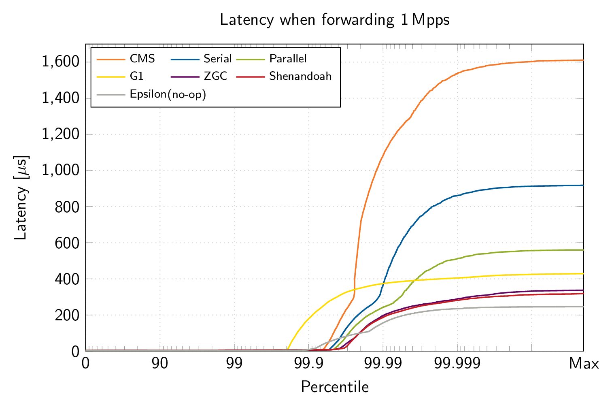

# Java garbage collector comparison
Context: Check out the [README file](README.md) first. This is an adapted excerpt from our research paper ["The Case for Writing Network Drivers in High-Level Languages"](https://www.net.in.tum.de/fileadmin/bibtex/publications/papers/the-case-for-writing-network-drivers-in-high-level-languages.pdf) [[BibTeX](https://www.net.in.tum.de/publications/bibtex/highleveldrivers.bib)].

OpenJDK 12 offers 7 different garbage collectors that all impact performance and latency in our driver in different ways.
ixy.java tries to avoid allocations wherever possible, but it's virtually impossible to write allocation-free idiomatic Java code, so we still allocate around 20 bytes on average per forwarded packet.

Epsilon, a garbage collector that never frees memory, is the fastest but it also crashes after a few minutes as it runs out of memory. The new Shenandoah collector doesn't do too well, unfortunately, but that should be fixed with OpenJDK 13.
Some GCs are as fast as the no-op implementation, this is because never freeing memory isn't ideal either: leaking memory leads to poor data locality as the heap fills up.

But throughput isn't everything, let's look at the latency.

Shenandoah seems to be a pretty good low-latency GC. It's even faster than not freeing memory at all with Epsilon: leaking memory has bad data locality so you run into all sorts of additional latency sources like TLB misses.

## Notes

Latency measurements are hard:

* These tests show the steady state by excluding the first 5 seconds because Java drops packets and shows excessive latencies during startup (milliseconds)
* We disabled printing statistics in the driver for Epsilon, ZGC and Shenandoah, this reduced latency from ~300 µs to ~45 µs for Shenandoah and Epsilon
* Other GCs perform *worse* when not printing statistics, so we kept that enabled for the other GCs

## What's the best GC?

Probably ZGC at the moment for a good trade-off between performance and latency.
But OpenJDK 13 should improve Shenandoah, we'll update this page as soon as we can get ixy.java running on OpenJDK 13 (blocked on unsupported dependencies).
